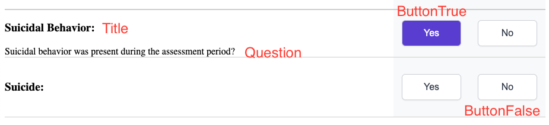

# BooleanQuestion

  

  

Above is two BooleanQuestion components as shown from C-SSRS-SLV

This component accepts props:

  

- title: string - isRequired,
	- Shown in image. Topmost text, is larger and bold
- stem: string,	
	- Used to *lead into* a question. Not shown. Appears above question.
- question: string,
	- Shown in image, the actual question
- buttonTrue: string - isRequired,
	-  The text for the button holding a true value
- buttonFalse: string - isRequired,
	-  The text for the button holding a false value
- skippable: bool,
	- Not currently implemented
- disabled: bool,
	- Disables the selection of either button, makes the question less opaque. This is often passed from parent as a reference to another answer value
- handleButtonChange: func - isRequired,
	- What to do when a user selects a button. This is often passed from parent as a way to change state
- selectionState: bool,
	- Used to determine the starting state of this component.