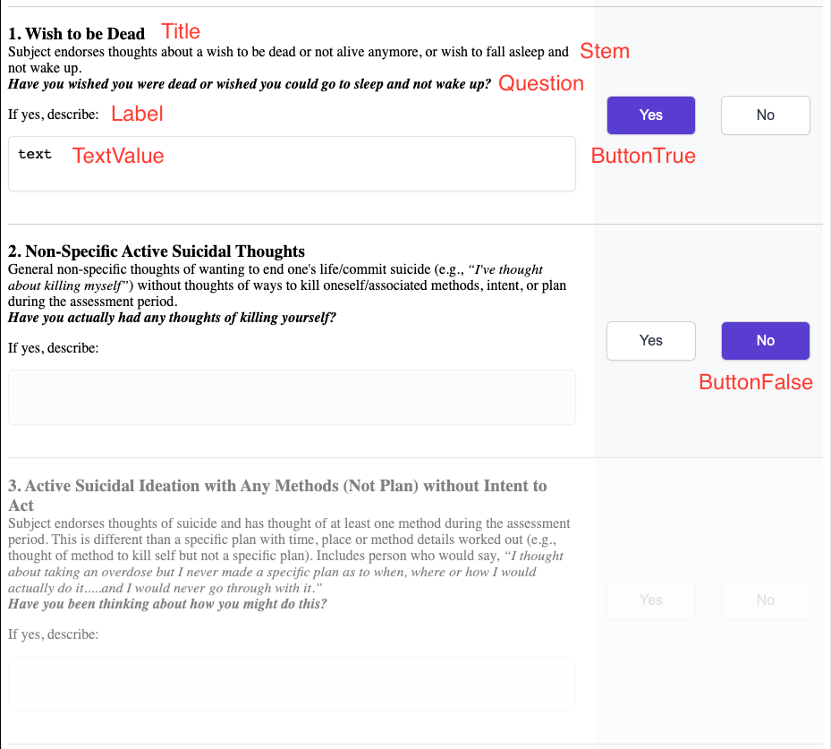

# BooleanQuestionWithTextField

Above is three BooleanQuestionWithTextField components as shown from C-SSRS-SLV

This component accepts props:

- title: string - isRequired,
  - Shown in image. Topmost text, is larger and bold
- stem: string,
  - Used to _lead into_ a question. Shown.
- question: string,
  - Shown in image, the actual question
- buttonTrue: string - isRequired,
  - The text for the button holding a true value
- buttonFalse: string - isRequired,
  - The text for the button holding a false value
- skippable: bool,
  - Not currently implemented
- disabled: bool,
  - Disables the selection of either button, makes the question less opaque. This is often passed from parent as a reference to another answer value. Shown as last question in image
- handleButtonChange: func - isRequired,
  - What to do when a user selects a button. This is often passed from parent as a way to change state
- selectionState: bool,
  - Used to determine the starting state of this component.
- label: string - isRequired
  - The label shown for the textarea
- textValue: string - isRequired
  - The state value held by the textarea, this should be passed in and should reference a key of the value object
- handleTextChange: func - isRequired
  - Updates the state value. Should be passed in
