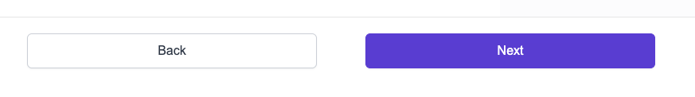

# Button

Above is two Button components as shown from NavigationButtons component

This component accepts props:

- text: string - isRequired
  - Shown as button text
- disabled: bool
  - The disabled state of the button. Makes it less opaque and unable to function
- accent: bool
  - Used to mark a button in the famous Medable purple
- onClick: func - isRequired
  - What to actually do when clicked