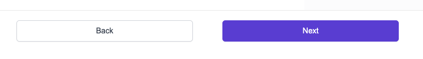

# NavigationButtons

Above is an example NavigationButtons component. Forward button is always accented.

This component accepts props:

- backwardFunc: func - isRequired
  - Function the back button performs
- forwardFunc: func - isRequired
  - Function the forward button performs
- backwardText: string - isRequired
  - Text for back button
- forwardText: string - isRequired
  - Text for forward button
- disabled: bool
  - The disabled state of the **forward button only**. We never remove the ability to go back
