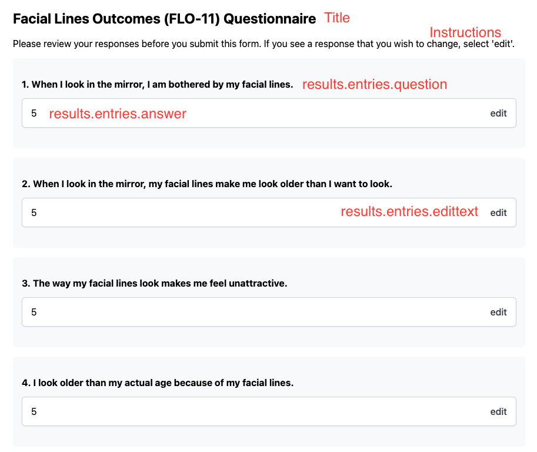

# ReviewScreen



Above is an example ReviewScreen component. Not pictured, this page includes NavigationButtons.

Requires a custom type, shown below. This must be built/calculated in the Page, then passed down once the values have been made to match.

This component accepts props:

- title: string
  - Shows at the top, bold
- instructions: string
  - Shows just below title
- backwardFunc: func - isRequired
  - Passed to NavigationButtons
- forwardFunc: func - isRequired
  - Passed to NavigationButtons
- backwardText: string - isRequired
  - Passed to NavigationButtons
- forwardText: string - isRequired
  - Passed to NavigationButtons
- results: arrayOf(resultType) // see below

**resultType**
Result type is an object matching the shape below

```
const resultType = {
  domain: string, // not shown, creates a large gray bar with a title when domain changes
  entries: arrayOf(
    shape({
      index: oneOf([number, string]), // not shown anywhere, used for reference in case
      answer: oneOf([
        number,
        string,
        bool,
      ]), // answer is shown in the image
      question: string, // shown in image, only shows if provided
      stem: string, // shows if provided
      title: string, // shows if provided
      editFunc: func, // shows if provided, requires editText as well
      editText: string, // shows if provided, requires editFunc as well
    })
  ),
};
```
