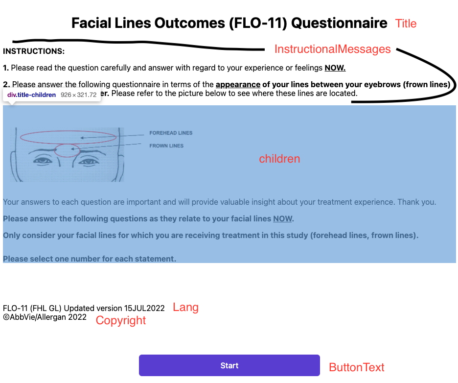

# TitlePage

Above is an example TitlePage component.

This component accepts props:

- title: string
  - Shown at the top of the page
- lang: string
  - Shown in a section towards the bottom with copyright
- copyright: string
  - Shown in a section towards the bottom with lang
- buttonText: string - isRequired
  - Displayed by the button, usually "Start" or something like that
- buttonFunc: func - isRequired
  - Navigation forward basically
- instructionalMessages: arrayOf(string)
  - If provided, will map them out. Shown in image

React allows you to pass elements/components as children of other components. This is not done like other props, rather by wrapping the parent around them.
In the example we see above, the TitlePage wraps an \ element, and an InstructionalMessages component. These are highlighted in blue.
